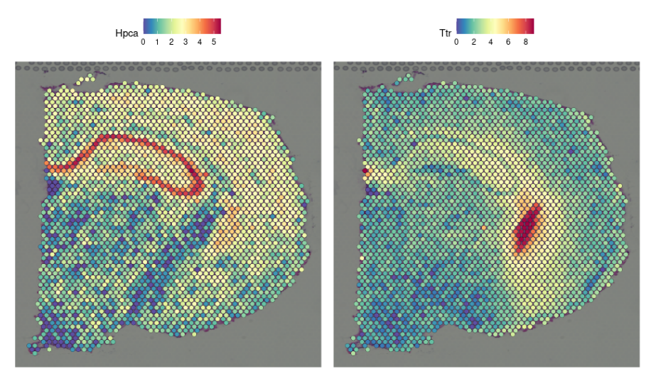

# Spatial transcriptomics tutorial

A workthrough of the Seurat spatial transcriptomics pipline in Seurat using spaceranger output directory. Most code snippets taken from:

-   <https://github.com/satijalab/seurat/blob/master/vignettes/spatial_vignette.Rmd>
-   <https://support.10xgenomics.com/spatial-gene-expression/software/pipelines/latest/tutorials/count-ff-tutorial>

